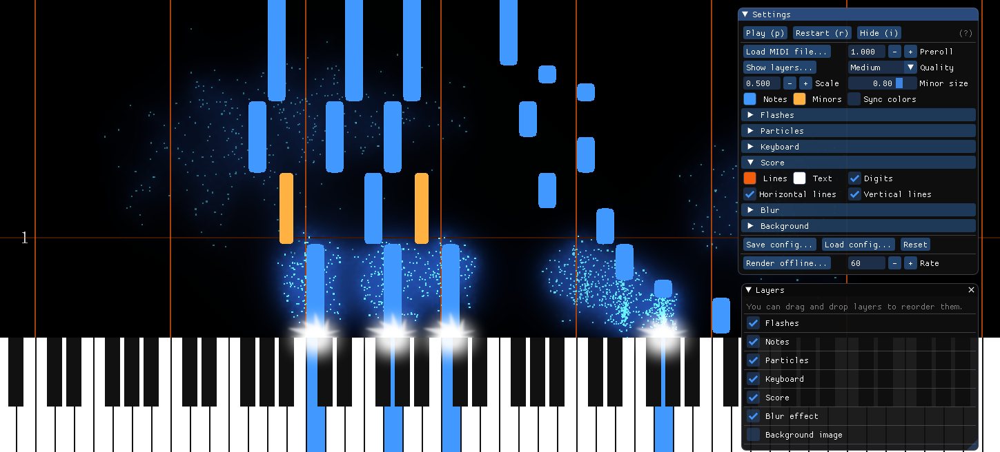

# MIDI Visualizer

A small MIDI visualizer, written in C++/OpenGL. 

  

## Usage

On all platforms, you can now **run the application by simply double-clicking** on it. You will then be able to select a MIDI file to load. A *Settings* panel now allows you to modify display parameters such as color, scale, lines,... Note that MIDIVisualizer is currently not able to *play* soundtracks, only *display* them.

Press `p` to play/pause the track, `r` to restart at the beginning of the track, and `i` to show/hide the *Settings* panel. 

Binaries for macOS and Windows are available in the [Releases tab](https://github.com/kosua20/MIDIVisualizer/releases).

## Compilation

The project is configured using Cmake.

    mkdir build && cd build
    cmake ..
    
Depending on the target you chose in Cmake, you will get either a Visual Studio solution, an Xcode workspace or a set of Makefiles. You can build the main executable using the `MIDIVisualizer`sub-project/target. If you update the images or shaders in the `resources` directory, you will have to repackage them with the executable, by building the `Packaging` sub-project/target. MIDIVisualizer depends on the [GLFW3 library](http://www.glfw.org) and the [Native File Dialog library](https://github.com/mlabbe/nativefiledialog), both are included in the repository and built along with the main executable.

## Command-line use
### macOS and Linux

You can run the executable from the command-line, specifying a MIDI file to read, along with optional settings such as the scale and color of the notes (by setting the red, green and blue components as numbers between 0.0 and 1.0).

    ./MIDIVisualizer path/to/file.mid [scale] [red green blue]
    

### Windows

You can run the executable from the command-line, specifying a MIDI file to read, along with optional settings such as the scale and color of the notes (by setting the red, green and blue components as numbers between 0.0 and 1.0).

    MIDIVisualizer.exe path\to\file.mid [scale] [red green blue]

## Development

The main development steps were:

- loading a MIDI file, and parsing the notes contained,
- displaying a scrolling score with these notes,
- adding visual effects to embellish the visualization.

More details [on my blog](http://blog.simonrodriguez.fr/articles/28-12-2016_midi_visualization_a_case_study.html).

 

 

 

 
