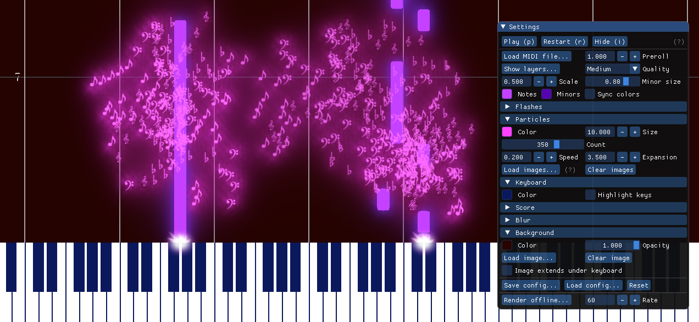

# MIDI Visualizer

A small MIDI visualizer, written in C++/OpenGL. 

  

## Usage

On Windows and macOS platforms, you can now **run the application by simply double-clicking** on it. You will then be able to select a MIDI file to load. A *Settings* panel allows you to modify display parameters such as color, scale, lines,... Images and videos of the track can be exported. Note that MIDIVisualizer is currently not able to *play* soundtracks, only *display* them.

Press `p` to play/pause the track, `r` to restart at the beginning of the track, and `i` to show/hide the *Settings* panel. 

Binaries for Windows, macOS and Ubuntu (experimental) are available in the [Releases tab](https://github.com/kosua20/MIDIVisualizer/releases).

 

## Command-line use

You can also run the executable from the command-line, specifying a midi file and display options. You can also trigger a video export directly from the command line. For instance:
	
	./MIDIVisualizer --midi path/to/file.mid --size 1920 1080 --config my/config.ini --export video.mp4  --format MPEG4
	
### General options

	--midi              path to a MIDI file to load
	--config            path to a configuration INI file
	--size              dimensions of the window (--size W H)
	--help              display a detailed help of all options
	
### Export options
If you want to directly export a video/images, `--export ...` is mandatory. You can completely hide the application window using `--hide-window`.

	--export            path to the output video (or directory for PNG)
	--format            output format (values: PNG, MPEG2, MPEG4)
	--framerate         number of frames per second to export (integer)
	--bitrate           target video bitrate in Mb (integer)
	--png-alpha         use transparent PNG background (1 or 0 to enabled/disable)
	--hide-window       do not display the window (1 or 0 to enabled/disable)
	
### Configuration options
If display options are given, they will override those specified in the configuration file. Almost every option available in the GUI can be specified on the command line, refer to the detailed help for a complete list (`./MIDIVisualizer --help`). Options include:

	--color-bg          Background color (R G B in [0.0, 1.0])
	--flashes-size      Flash effect size (number in [0.100000,3.000000])
	--particles-count   Particles count (integer in [1,512])
	--preroll           Preroll time in seconds before starting to play (number)
	--quality           Rendering quality (values: LOW_RES, LOW, MEDIUM, HIGH, HIGH_RES)	--show-keyboard     Should the keyboard be shown (1 or 0 to enable/disable)
	...

 

## Compilation

The project is configured using Cmake.

    mkdir build && cd build
    cmake ..
    
Depending on the target you chose in Cmake, you will get either a Visual Studio solution, an Xcode workspace or a set of Makefiles. You can build the main executable using the `MIDIVisualizer`sub-project/target. If you update the images or shaders in the `resources` directory, you will have to repackage them with the executable, by building the `Packaging` sub-project/target. MIDIVisualizer depends on the [GLFW3 library](http://www.glfw.org) and the [Native File Dialog library](https://github.com/mlabbe/nativefiledialog), both are included in the repository and built along with the main executable. MIDIVisualizer optionally relies on [FFMPEG](https://ffmpeg.org) for video export. For licensing reasons only MPEG-2 and MPEG-4 exports are supported for now.

## Development

The main development steps were:

- loading a MIDI file, and parsing the notes contained,
- displaying a scrolling score with these notes,
- adding visual effects to embellish the visualization,
- maintaining the application and listening to user requests :)

More details on the initial project [on my blog](http://blog.simonrodriguez.fr/articles/28-12-2016_midi_visualization_a_case_study.html).

 

 
